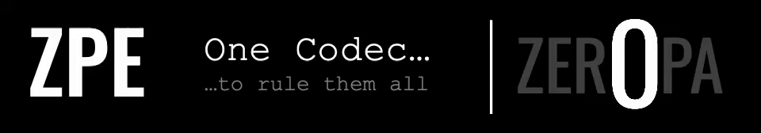

<p>
  
</p>

# ZPE-Robotics

[](./pyproject.toml)
[](./pyproject.toml)
[](./LICENSE)

SAL v7.1 — free below $100M annual revenue. See [LICENSE](LICENSE).

---

## What This Is

<p>
  
</p>

187x robot-motion compression. Searchable joint-stream archives. VLA token export. Bounded-lossy replay for smooth trajectories. Install from PyPI: `pip install zpe-robotics`

**187× compression on real robot joint streams** (vs zstd_l19 4.59×, vs zstd_l3 4.44×) — with PrimitiveIndex search and VLA token export. Governing benchmark: LeRobot real-data suite, 3 datasets across 3 families. Proof path: [`proofs/enterprise_benchmark/GATE_VERDICTS.json`](proofs/enterprise_benchmark/GATE_VERDICTS.json).

ZPE-Robotics compresses and replays joint-stream logs for infrastructure teams that need searchable motion archives instead of raw bagfiles. The `187×` figure is real and bounded-lossy (smooth-trajectory slices; step inputs cause Gibbs ringing — see footnote). Engineering surface remains blocker-governed: step-sequence behavior, comparator closure, and runtime closure are not closed.

Wire encoding: `wire-v1` (frozen packet contract; authority: [`docs/ZPBOT_V2_AUTHORITY_SURFACE.md`](docs/ZPBOT_V2_AUTHORITY_SURFACE.md))

## Codec Mechanics

<p>
  
</p>

| Field | Value |
|-------|-------|
| Architecture | MANIFOLD_MOTION |
| Encoding | WIRE_V1 |
| Mechanics Asset | `.github/assets/readme/lane-mechanics/ROBOTICS.gif` |

## Key Metrics

| Metric | Value | Baseline / Notes |
|--------|-------|----------|
| COMPRESSION | 187׆ | LeRobot real-data benchmark; full baselines in Competitive Benchmarks section |
| ENCODE_P50 | 0.11 ms | per 1 000 frames, gate B4 PASS |
| DECODE_P50 | 0.089 ms | per 1 000 frames, gate B5 PASS |
| BENCHMARK_GATES | 4/5 | 3 datasets, 3 families; B3 (bit-exact) fails |

> Sources: [`proofs/enterprise_benchmark/GATE_VERDICTS.json`](proofs/enterprise_benchmark/GATE_VERDICTS.json) (B2: 40.74× vs zstd_l19, B4/B5 latency) | [`proofs/red_team/red_team_report.json`](proofs/red_team/red_team_report.json) (42.14× vs zstd_l3, attack-5 FPR) | [`proofs/release_candidate/primitive_search_result.json`](proofs/release_candidate/primitive_search_result.json) (P@10) | [`proofs/release_candidate/anomaly_detection_result.json`](proofs/release_candidate/anomaly_detection_result.json) (FPR/recall) | [`proofs/release_candidate/it04_parity_matrix_result.json`](proofs/release_candidate/it04_parity_matrix_result.json) (cross-platform)

† Bounded-lossy. The ≤ 0.5° angular figure is limited to smooth-trajectory slices; it is not a general motion bound. Step/discontinuous inputs cause Gibbs ringing, with 68° RMSE measured on a unit-amplitude step signal. Baselines are lossless.

## Repo Identity

| Field | Value |
|-------|-------|
| Identifier | ZPE-Robotics |
| Repository | https://github.com/Zer0pa/ZPE-Robotics |
| Portfolio Category | Encoding |
| Website Mirror | /encoding/ZPE-Robotics/ |
| Visibility | PUBLIC |
| License | LicenseRef-Zer0pa-SAL-7.1 |
| License Terms | "FREE TO use, modify, and distribute below $100M annual revenue; see LICENSE for full terms." |
| Authority Source | proofs/ENGINEERING_BLOCKERS.md |
| Manifest | proofs/manifests/live_lab_status.json |
| Architecture | MANIFOLD_MOTION |
| Encoding | WIRE_V1 |

## Readiness

| Field | Value |
|-------|-------|
| Public Status | Claim-surface repair in progress; narrow archive/search evidence exists. |
| Current Surface | Robot motion archive compression, decoded-stream PrimitiveIndex search, and VLA token export on declared LeRobot datasets; 187x real-data anchor on columbia_cairlab_pusht_real (136 episodes, 27,808 frames). |
| Headline Metric | 187.1345x compression on bounded robot joint-stream surface; 3-dataset spread 58.70x–186.05x (median 61.27x); encode p50 0.111 ms; decode p50 0.089 ms. Source: `proofs/enterprise_benchmark/benchmark_result.json`. |
| Evidence Basis | `proofs/enterprise_benchmark/GATE_VERDICTS.json`; `proofs/enterprise_benchmark/benchmark_result.json`; `proofs/narrow_claim/NARROW_CLAIM_GATE.json`; `proofs/red_team/red_team_report.json`; `proofs/artifacts/lerobot_expanded_benchmarks/aggregate_spread_summary.json` |
| Pending Evidence | B3 bit-exact replay and search-without-decode closure or gate re-ratification (`proofs/enterprise_benchmark/GATE_VERDICTS.json`); step/discontinuous-input scope closure; lossless qualification repair or scope-out (red-team attack 3); independent third-party reproduction (red-team attack 7). |
| Authority Verdict | BLOCKED |
| Checks | 8/12 |
| Anchors | 6 |
| Confidence | UNSET |
| Commit | a391cdb5eb98 |
| Verified | 2026-05-03 UTC |
| Verdict Source | proofs/ENGINEERING_BLOCKERS.md |

### Honest Blocker

The live package and bounded benchmark surface are useful now for bounded-lossy robot joint-stream archiving, decoded PrimitiveIndex search, and VLA token export. Full release readiness still depends on B3 closure for bit-exact replay and search-without-decode, step/discontinuous-input scope closure, and independent third-party reproduction. Search-without-decode is not proven: PrimitiveIndex requires full packet decode before indexing.

### What's Next

- **Live-lab cleanup:** GitHub description and topics rewritten to remove "Search Without Decode" and lossless/compression overclaims; 3-dataset spread surfaced alongside the 187x anchor.
- **Website sync:** Mirror Public Status, 187.1345x with bounded-lossy label and 3-dataset spread, narrow-gate PASS + B3 FAIL state, search-without-decode non-claim, BLOCKED Authority Verdict preserved as the secondary cluster.
- **Future evidence campaign:** Decide whether B3's old gate is repaired or re-ratified for the narrow decoded-search surface; separately decide whether discontinuous inputs are repaired or permanently scoped out; independent third-party reproduction for red-team attack 7.

## What We Prove

> Auditable guarantees backed by committed proof artifacts. Start at `docs/AUDITOR_PLAYBOOK.md`.

- Spectral wire transport with directional reasoning layer for robot action sequences
- Search operates on decoded motion streams via PrimitiveIndex
- Red-team resilience: 4 attacks withstand, 1 fails, 1 partially withstands, 1 remains open
- VLA tokenization aligns with vision-language-action model input formats
- Public package acquisition route is `pip install zpe-robotics`; package
  availability does not change blocker status

## What We Don't Claim

- Full release readiness
- Bit-exact .zpbot round-trip replay
- B3 benchmark gate pass
- Red-team attack 3 lossless qualification
- General anomaly readiness beyond the declared threshold-selected holdout surface
- Robotics Rust ABI
- Independent third-party reproduction
- Generally valid ≤ 0.5° angular fidelity — the figure comes from smooth-trajectory slices only; FFT-based encoding causes Gibbs ringing on step/discontinuous inputs (68° RMSE measured on a unit-amplitude step signal)
- Search-without-decode — PrimitiveIndex requires full packet decode before indexing

## Verification Status

| Code | Check | Verdict |
|------|-------|---------|
| V_01 | BENCHMARK_GATE_B1_COMPRESSION | PASS |
| V_02 | BENCHMARK_GATE_B2_ZSTD_BASELINE | PASS |
| V_03 | BENCHMARK_GATE_B3_BIT-EXACT_+_SE... | FAIL |
| V_04 | BENCHMARK_GATE_B4_ENCODE_LATENCY | PASS |
| V_05 | BENCHMARK_GATE_B5_DECODE_LATENCY | PASS |
| V_06 | RED-TEAM_ATTACK_1_BASELINE | PASS |
| V_07 | RED-TEAM_ATTACK_2_ENTROPY | PASS |
| V_08 | RED-TEAM_ATTACK_3_LOSSLESS_QUALI... | FAIL |
| V_09 | RED-TEAM_ATTACK_4_CORPUS_ADEQUACY | INC |
| V_10 | RED-TEAM_ATTACK_5_FALSE-POSITIVE... | PASS |
| V_11 | RED-TEAM_ATTACK_6_PYTHON_3.12_PA... | PASS |
| V_12 | RED-TEAM_ATTACK_7_EXTERNAL_REPRO... | INC |

<p>
  
</p>

## Proof Anchors

<p>
  
</p>

| Path | State |
|------|-------|
| `proofs/ENGINEERING_BLOCKERS.md` | VERIFIED |
| `proofs/narrow_claim/NARROW_CLAIM_GATE.json` | VERIFIED |
| `proofs/enterprise_benchmark/GATE_VERDICTS.json` | VERIFIED |
| `proofs/red_team/red_team_report.json` | VERIFIED |
| `proofs/release_candidate/clean_clone_result.json` | VERIFIED |
| `proofs/release_candidate/it04_parity_matrix_result.json` | VERIFIED |

## Repo Shape

<p>
  
</p>

| Field | Value |
|-------|-------|
| Proof Anchors | 6 display anchors |
| Modality Lanes | 3 |
| Architecture | MANIFOLD_MOTION |
| Encoding | WIRE_V1 |
| Verification | 8/12 checks |
| Authority Source | `proofs/ENGINEERING_BLOCKERS.md` |

The modality-lane count reflects the three recorded parity lanes
(`arm64-qemu`, `macos`, `ubuntu-x86`) in
`proofs/release_candidate/it04_parity_matrix_result.json`.

| Area | Purpose |
|---|---|
| `src/zpe_robotics/` | package implementation, CLI, packet handling, search, anomaly, and audit logic |
| `tests/` | release-surface, CLI, codec, and regression checks |
| `scripts/` | replay, benchmark, falsification, and clean-clone helpers |
| `docs/` | front-door, architecture, support, legal, and family-linkage docs |
| `proofs/` | blockers, benchmark artifacts, red-team outputs, release runbooks, and historical bundles |
| `.github/workflows/` | CI, clean-clone, parity, comparator, and publish workflows |

<p>
  
</p>

## Extended Metrics

Rows retained from the previous expanded `## Key Metrics` table. The public product page uses the four-row metric ladder above.

| Metric | Value | Baseline / Notes |
|--------|-------|----------|
| VLA_TOKEN_EXPORT | 24-token FAST surface | [`vla_bridge.py`](src/zpe_robotics/vla_bridge.py) |
| PRIMITIVE_SEARCH P@10 | 1.0 | on REACH template, synthetic corpus |
| ANOMALY_FPR | 0.05 | recall=0.9 at threshold=3.22; Phase 10 holdout (100 nominal / 10 anomalous) |
| CROSS_PLATFORM_PARITY | PASS (3 lanes) | arm64-qemu / macOS / ubuntu-x86 produce identical SHA256 |

## Competitive Benchmarks

> Competitive benchmark evidence: [`proofs/enterprise_benchmark/benchmark_result.json`](proofs/enterprise_benchmark/benchmark_result.json) | [`proofs/red_team/red_team_report.json`](proofs/red_team/red_team_report.json) | [`proofs/artifacts/lerobot_expanded_benchmarks/aggregate_spread_summary.json`](proofs/artifacts/lerobot_expanded_benchmarks/aggregate_spread_summary.json)

| Tool | Compression Ratio | Notes |
|------|-------------------|-------|
| **ZPE P8** | **187.13׆** | governing LeRobot real-data benchmark; PrimitiveIndex search requires decode |
| zstd_l19 | 4.59× | strongest retained classical codec; ZPE is 40.74× better (gate B2 PASS) |
| zstd_l3 | 4.44× | red-team attack 1 baseline; ZPE is 42.14× better |
| gzip_l9 | 3.97× | retained gzip baseline |
| mcap_zstd | 3.99× | MCAP container baseline |
| lz4_default | 3.00× | low-latency baseline |
| h5py_gzip9 | 2.69× | HDF5 gzip baseline |
| h5py_lzf | 2.15× | HDF5 fast baseline |

† Bounded-lossy. The ≤ 0.5° angular figure is limited to smooth-trajectory slices; it is not a general motion bound. Step/discontinuous inputs cause Gibbs ringing, with 68° RMSE measured on a unit-amplitude step signal. All other baselines are lossless.

## Selected Claim Gate

| Field | Value |
|-------|-------|
| Gate | bounded-lossy archive/search |
| Gate Status | PASS for the narrow claim only |
| Full Engineering | BLOCKED |
| Proof | `proofs/narrow_claim/NARROW_CLAIM_GATE.json` |

## Quick Start

<p>
  
</p>

| Surface | Current truth |
|---|---|
| Repository | `https://github.com/Zer0pa/ZPE-Robotics.git` |
| Package / import / CLI | `zpe-robotics` / `zpe_robotics` / `zpe-robotics` |
| Acquisition surface | `pip install zpe-robotics` (available on PyPI) |
| License | `LicenseRef-Zer0pa-SAL-7.1` |
| Contact | `architects@zer0pa.ai` |
| Release state | public repo and published package; engineering surface remains blocker-governed |
| Engineering | not complete |
| Current authority | `proofs/ENGINEERING_BLOCKERS.md` |

| Authority layer | File |
|---|---|
| governing blocker state | `proofs/ENGINEERING_BLOCKERS.md` |
| benchmark gate verdicts | `proofs/enterprise_benchmark/GATE_VERDICTS.json` |
| adversarial verdicts | `proofs/red_team/red_team_report.json` |
| package/runtime boundary | `proofs/runbooks/TECHNICAL_RELEASE_SURFACE.md` |
<p>
  
</p>

Install from PyPI:

```bash
pip install zpe-robotics
zpe-robotics --version
```

Or install from source (development):

```bash
pip install -e .
zpe-robotics --version
```

Repo-local engineering surface:

```bash
python -m venv .venv
source .venv/bin/activate
python -m pip install --upgrade pip setuptools wheel
python -m pip install -e ".[dev,benchmark,telemetry,netnew]"
python -m pytest tests -q
python -m build
```

If you need the shortest honest verification route, use
`docs/AUDITOR_PLAYBOOK.md`.
If you need the release workflow boundary, use
`proofs/runbooks/TECHNICAL_RELEASE_SURFACE.md`.

<p>
  
</p>

| Need | Route |
|---|---|
| Security reporting | `SECURITY.md` |
| Claim boundary | `docs/CLAIM_BOUNDARY.md` |
| Support routing | `docs/SUPPORT.md` |
| Docs index | `docs/README.md` |
| Operator commands | `docs/OPERATOR_RUNBOOK.md` |

## Ecosystem

ZPE-Robotics is an independent motion-telemetry lane in the Zer0pa encoding portfolio. It carries its own claims, blocker state, proof surface, and release readiness.

| Need | Route |
|---|---|
| Frozen proof lineage note | `proofs/README_LINEAGE_PATHS.md` |

**Observability:** [Comet dashboard](https://www.comet.com/zer0pa/zpe-robotics/view/new/panels) (public)

## Who This Is For

ZPE-Robotics is one of 17 independent encoding products in the Zer0pa portfolio — each domain-specific, each carrying its own proof surface. Robotics addresses motion telemetry; it does not inherit claims or release status from any other lane.

| | |
|---|---|
| **Ideal first buyer** | Robotics infrastructure team or simulation/replay platform |
| **Pain** | Robot telemetry archives grow fast and can only be searched after full decompression — replay pipelines lack determinism guarantees |
| **Deployment** | Public Python package — `pip install zpe-robotics` |
| **Family position** | Independent motion-telemetry lane in the Zer0pa portfolio. Claims, blocker state, and release readiness are Robotics-specific. |

## Upcoming Workstreams

This section captures the active lane priorities — what the next agent or contributor picks up, and what investors should expect. Cadence is continuous, not milestoned.

- **Step-input Gibbs ringing fix (B3 gate)** — Research-Deferred — Investigation Underway. Highest-value research investment in the portfolio. Investigation: discontinuity-aware primitive (pre-detect step → switch encoding regime), or hybrid mode falling back to a lossless coder for step segments. Until resolved, lane is honestly scoped to smooth-trajectory bounded-lossy slices.
- **Third-party reproduction (Attack 7)** — Operations / External Dependency. INCONCLUSIVE pending independent run; surface contact requested.
