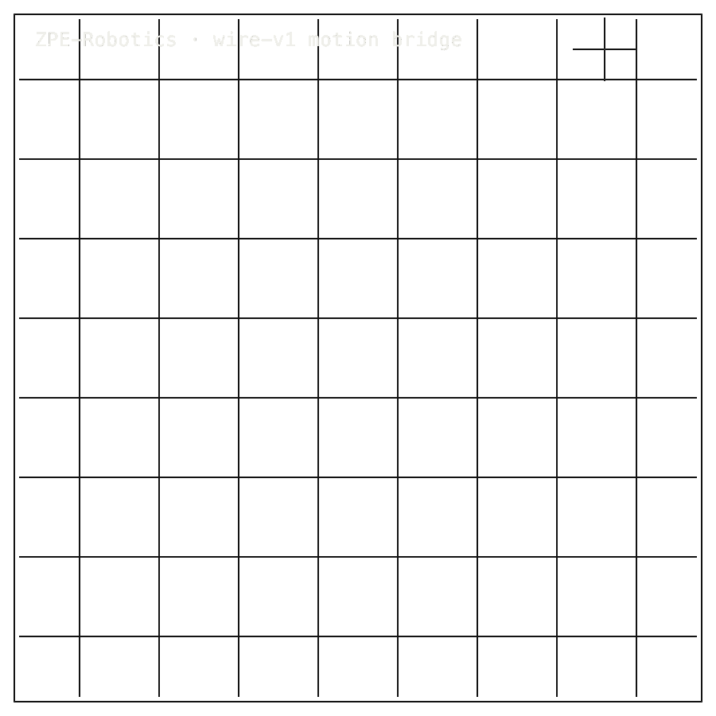

# ZPE-Robotics

## Package Install

Installable package: `pip install zpe-robotics`.
Source: [Zer0pa/ZPE-Robotics](https://github.com/Zer0pa/ZPE-Robotics/).

```bash
pip install zpe-robotics
```

For full install, smoke, source, and developer commands, [click here](#install-developer-commands-detailed).

---

<table width="100%">
<tr>
<td width="100%" valign="top">
<div><span><b>00 · ZPE-ROBOTICS · MOVEMENT MEMORY</b></span> <span>DEVELOPER-READY · B3 OPEN</span></div>
      <h1>Robots that learn <span>like humans do.</span></h1>
      <p>A movement memory for robots &mdash; the form of an action, kept · ZPE-Robotics · PyPI <em>zpe-robotics</em> v0.1.1 · github.com/Zer0pa/ZPE-Robotics</p>
      <p>A person learns a waltz, a kung fu form, or how to pick something up the same way &mdash; by repeating the movement until its shape settles into the body. What stays is not one attempt; it is the form. Robots have never had a memory for that. ZPE-Robotics is one: it keeps the form of an action &mdash; pick, wipe, push, pull &mdash; so a robot can hold a movement, search it, and learn from it. Proven on smooth motion, real LeRobot data, at <strong>187&times;</strong>.</p>
</td>
</tr>
</table>

<table width="100%">
<tr>
<td width="100%" valign="top">
<figure>
        <div></div>
        <figcaption><b>Scope:</b> bounded-lossy smooth movement archive. No live closed-loop control, no general bit-level replay, no search without decode.</figcaption>
      </figure>
</td>
</tr>
</table>

<table width="100%">
<tr>
<td width="100%" valign="top">
<div><b>01 · THE GAP</b> <span>RECORDED, NOT LEARNED</span></div>
      <h2>A robot records a movement perfectly, yet cannot learn it &mdash; a recording is not a memory.</h2>
</td>
</tr>
</table>

<table width="100%">
<tr>
<td width="100%" valign="top">
<div><b>02 · MARKETS</b> <span>ADJACENT FORECASTS</span></div>
      <div>Robot software &mdash; &rsquo;31 &mdash; $67.9B · Digital twin &mdash; &rsquo;30 &mdash; $155.8B · Warehouse robotics &mdash; &rsquo;30 &mdash; $17.3B · Industrial robotics &mdash; &rsquo;30 &mdash; $16.5B · AMR &mdash; &rsquo;30 &mdash; $8.7B · <em>source:</em> Next Move Strategy, MarketsandMarkets</div>
      <div>Every robot that learns to move works inside these markets; ZPE-Robotics is the memory beneath them.</div>
</td>
</tr>
</table>

<table width="100%">
<tr>
<td width="50%" valign="top">
<div><b>03 · VALUE OF MARKET</b></div>
      <div>187<span>&times;</span></div>
      <div>Compression vs zstd_l19 on real LeRobot joint streams &middot; <b>bounded-lossy smooth motion</b></div>
</td>
<td width="50%" valign="top">
<div><b>04 · INSIGHT</b></div>
      <h2>Practiced enough, a movement leaves one thing behind: <span>its form.</span></h2>
</td>
</tr>
</table>

<table width="100%">
<tr>
<td width="50%" valign="top">
<div><b>05.1 · CURRENT TECH</b> <span>RECORDED AND SHELVED</span></div>
        <p>Today a robot's movement gets dumped into ROS bagfiles or parquet. The files are large, findable only by timestamp or filename, never by the movement itself. Nothing downstream can learn from a recording it cannot read.</p>
</td>
<td width="50%" valign="top">
<div><b>05.2 · OUR TECH</b> <span>KEEP THE FORM</span></div>
        <p>ZPE-Robotics keeps the form. It encodes a robot's movement into a bounded-lossy archive &mdash; keeping the shape of the action, dropping the once-only noise &mdash; at <strong>187&times;</strong> on real LeRobot data. PrimitiveIndex returns runs by the movement inside them: every clean reach, every dropped grasp, every recovered pour. Pick, wipe, push, pull become findable, not just stored.</p>
</td>
</tr>
</table>

<table width="100%">
<tr>
<td width="100%" valign="top">
<div><b>05.3 · BENCHMARKS</b> <span>LEROBOT REAL DATA</span></div>
      <div>
        <div>
          <div><span>Compression</span><b>187.13</b><small>&times; vs zstd_l19</small></div>
          <div><span>Encode P50</span><b>0.111</b><small>ms / 1k frames</small></div>
          <div><span>Decode P50</span><b>0.089</b><small>ms / 1k frames</small></div>
          <div><span>Checks</span><b>4/5</b><small>archive suite</small></div>
        </div>
        <div>
          <div><span>B1 compression</span>  <span>PASS</span></div>
          <div><span>B2 zstd baseline</span>  <span>PASS</span></div>
          <div><span>Replay + search</span>  <span>OPEN</span></div>
        </div>
      </div>
      <div><b>Scope:</b> 3 LeRobot datasets; 58.70&ndash;186.05&times; spread. General replay and search remain open.</div>
</td>
</tr>
</table>

<table width="100%">
<tr>
<td width="34%" valign="top">
<div><b>06 · MEASUREMENT</b> <span>MEASURED ARCHIVE SURFACE</span></div>
      <h2>Archive claims stay tied to real LeRobot slices and <span>smooth-motion limits.</span></h2>
</td>
<td width="66%" valign="top">
<div><b>06.1 · COMPARATIVE PERFORMANCE &middot; LEROBOT BYTES PER FRAME</b></div>
      <div>
        <div>
          <div><span>ZPE-Robotics</span>  <span>187.13&times; smaller</span></div>
          <div><span>zstd_l19</span>  <span>4.59&times; vs raw</span></div>
          <div><span>zstd_l3</span>  <span>4.44&times; vs raw</span></div>
          <div><span>raw float32</span>  <span>1.00&times; baseline</span></div>
        </div>
      </div>
      <div>LeRobot declared episodes (<b>columbia_cairlab_pusht_real</b>, 136 episodes, 27,808 frames), smooth-trajectory slices. Baselines are lossless zstd, gzip, lz4, MCAP, HDF5 variants. Spread across 3 datasets: 58.70&ndash;186.05&times;, median 61.27&times;. Source: <em>proofs/enterprise_benchmark/benchmark_result.json</em>.</div>
</td>
</tr>
</table>

<table width="100%">
<tr>
<td width="100%" valign="top">
<div><b>07 · KEY METRICS</b> <span>MEASURED RESULTS</span></div>
</td>
</tr>
</table>

<table width="100%">
<tr>
<td width="100%" valign="top">
<div><b>07.1 · COMPRESSION</b></div>
      <div>187.13<span>&times;</span></div>
      <div>vs zstd_l19 4.59&times; &middot; <b>bounded-lossy LeRobot data</b></div>
</td>
</tr>
</table>

<table width="100%">
<tr>
<td width="100%" valign="top">
<div><b>07.2 · ENCODE P50</b></div>
      <div>0.111<span>ms</span></div>
      <div>per 1k frames &middot; <b>check B4 PASS</b></div>
</td>
</tr>
</table>

<table width="100%">
<tr>
<td width="100%" valign="top">
<div><b>07.3 · DECODE P50</b></div>
      <div>0.089<span>ms</span></div>
      <div>per 1k frames &middot; <b>check B5 PASS</b></div>
</td>
</tr>
</table>

<table width="100%">
<tr>
<td width="100%" valign="top">
<div><b>07.4 · ARCHIVE CHECKS</b></div>
      <div>4 / 5<span>PASS</span></div>
      <div>smooth archive PASS &middot; <b>general replay open</b></div>
</td>
</tr>
</table>

<table width="100%">
<tr>
<td width="100%" valign="top">
<div><b>07.5 · DATASET SPREAD</b></div>
      <div>61.27<span>&times;</span></div>
      <div>median of 3 LeRobot datasets &middot; <b>187.13&times; peak</b></div>
</td>
</tr>
</table>

<table width="100%">
<tr>
<td width="100%" valign="top">
<div><b>08 · REPLAY FIDELITY</b> <span>SMOOTH VS STEP</span></div>
      <h2>Smooth movement stays inside the archive boundary. Stepped movement <span>does not.</span></h2>
</td>
</tr>
</table>

<table width="100%">
<tr>
<td width="66%" valign="top">
<div><b>08.1 · WHAT THE ARCHIVE SUPPORTS</b> <span>SMOOTH SLICE</span></div>
      <p>On smooth-trajectory slices of declared LeRobot data, movement encodes and decodes consistently across arm64, macOS and x86. A sharp or stepped movement does not: the FFT-based encoder rings &mdash; Gibbs distortion &mdash; measured at <strong>68&deg; RMSE on a unit-amplitude step</strong>. A step has no smooth form to keep.</p>
      <p>Search-without-decode and general bit-level replay remain open. PrimitiveIndex still walks decoded streams. The credibility claim is bounded-lossy smooth movement &mdash; useful for archive, analysis, and downstream teaching, not for live closed-loop control where every byte of the motion has to come back exactly.</p>
</td>
<td width="34%" valign="top">
<div><b>08.2 · HONEST BLOCKER</b></div>
      <span>Honest Blocker &middot;</span>
      <p><strong>187&times; is bounded-lossy</strong> on smooth movement; sharp, stepped movement still rings. General replay and search-without-decode are false. PrimitiveIndex requires decode. PyPI v0.1.1 is stale; zpe-motion-kernel is legacy; no Robotics Rust ABI. RT3 miss, RT4 partial, RT7 open.</p>
</td>
</tr>
</table>

<table width="100%">
<tr>
<td width="33%" valign="top">
<div><b>09</b> </div>
      <h2>WHEN MOVEMENT BECOMES <span>MEMORY.</span></h2>
</td>
<td width="67%" valign="top">
<div><b>09.1 · THE AMBITION</b></div>
      <p>The aim is not a better robot policy &mdash; it is the memory underneath one. A robot that keeps the form of a movement can recall it, refine it, and pass it on. Demonstration stops being disposable capture and starts behaving like inventory a fleet can build on.</p>
</td>
</tr>
</table>

<table width="100%">
<tr>
<td width="33%" valign="top">
<div><b>09.2 · WHAT WORKS NOW</b> </div>
        <h2>Working today, on smooth movement: 187&times; archives and recall by the shape of the action itself.</h2>
</td>
<td width="67%" valign="top">
<div><b>09.3 · WHAT'S STILL OPEN</b> </div>
        <h2>Still open: bit-level replay, sharp-movement distortion, search without decode, independent reproduction, a current release.</h2>
</td>
</tr>
</table>

<table width="100%">
<tr>
<td width="100%" valign="top">
<div><b>09.4</b> &middot; REPERTOIRE &middot; NEAR-TERM (12&ndash;24 MO)</div>
      <div>A robot keeps every taught movement</div><div>A teleoperation team that used to throw away demonstrations after training can now keep every pick, wipe, push, and pull. At 187&times; on smooth motion, a humanoid's entire taught repertoire fits in the space its raw logs used to take for one afternoon.</div>
</td>
</tr>
</table>

<table width="100%">
<tr>
<td width="100%" valign="top">
<div><b>09.5</b> &middot; RECALL &middot; NEAR-TERM (12&ndash;24 MO)</div>
      <div>Engineers find runs by the movement</div><div>A robotics platform engineer hunting a specific failure mode stops scrubbing video and grepping bag files. The archive returns every clean reach, every dropped grasp, every retry by the shape of the action &mdash; so the question &ldquo;show me the bad pours&rdquo; gets a direct answer.</div>
</td>
</tr>
</table>

<table width="100%">
<tr>
<td width="100%" valign="top">
<div><b>09.6</b> &middot; TEACHING &middot; MID-TERM (24&ndash;48 MO)</div>
      <div>One robot's motion teaches the next</div><div>A humanoid R&amp;D lead exporting movements as vision-language-action tokens hands a taught skill straight into the next model generation. The form one robot kept after a thousand pours becomes the starting condition for the robot that hasn't poured anything yet.</div>
</td>
</tr>
</table>

<table width="100%">
<tr>
<td width="100%" valign="top">
<div><b>09.7</b> &middot; SIMULATION &middot; MID-TERM (24&ndash;48 MO)</div>
      <div>Simulation gets real demonstrations back</div><div>Once replay closes for stepped motion, a simulation team can rerun the actual factory floor inside their environment &mdash; the dropped boxes, the missed grasps, the recoveries &mdash; instead of synthesising plausible ones. Sim and reality converge around the same retained movement.</div>
</td>
</tr>
</table>

<table width="100%">
<tr>
<td width="100%" valign="top">
<div><b>09.8</b> &middot; APPRENTICESHIP &middot; PARADIGM (48 MO+)</div>
      <div>Robots learn the way apprentices do</div><div>When movement can be kept, searched, and faithfully replayed, a robot stops being trained by exposure and starts being taught the way a person learns a craft &mdash; holding each form, refining it across attempts, passing it to the next robot the way a master hands down a technique.</div>
</td>
</tr>
</table>

---

<a id="install-developer-commands-detailed"></a>

## Install / Developer Commands Detailed

#### Quick Start

<p>
  
</p>

| Surface | Current truth |
|---|---|
| Repository | `https://github.com/Zer0pa/ZPE-Robotics.git` |
| Package / import / CLI | `zpe-robotics` / `zpe_robotics` / `zpe-robotics` |
| Acquisition surface | `pip install zpe-robotics` (available on PyPI) |
| License | `LicenseRef-Zer0pa-SAL-7.1` |
| Contact | `architects@zer0pa.ai` |
| Release state | public repo and published package; engineering surface remains blocker-governed |
| Engineering | not complete |
| Current authority | `proofs/ENGINEERING_BLOCKERS.md` |

| Authority layer | File |
|---|---|
| governing blocker state | `proofs/ENGINEERING_BLOCKERS.md` |
| benchmark gate verdicts | `proofs/enterprise_benchmark/GATE_VERDICTS.json` |
| adversarial verdicts | `proofs/red_team/red_team_report.json` |
| package/runtime boundary | `proofs/runbooks/TECHNICAL_RELEASE_SURFACE.md` |
<p>
  
</p>

Install from PyPI:

```bash
pip install zpe-robotics
zpe-robotics --version
```

Or install from source (development):

```bash
pip install -e .
zpe-robotics --version
```

Repo-local engineering surface:

```bash
python -m venv .venv
source .venv/bin/activate
python -m pip install --upgrade pip setuptools wheel
python -m pip install -e ".[dev,benchmark,telemetry,netnew]"
python -m pytest tests -q
python -m build
```

If you need the shortest honest verification route, use
`docs/AUDITOR_PLAYBOOK.md`.
If you need the release workflow boundary, use
`proofs/runbooks/TECHNICAL_RELEASE_SURFACE.md`.

<p>
  
</p>

| Need | Route |
|---|---|
| Security reporting | `SECURITY.md` |
| Claim boundary | `docs/CLAIM_BOUNDARY.md` |
| Support routing | `docs/SUPPORT.md` |
| Docs index | `docs/README.md` |
| Operator commands | `docs/OPERATOR_RUNBOOK.md` |
